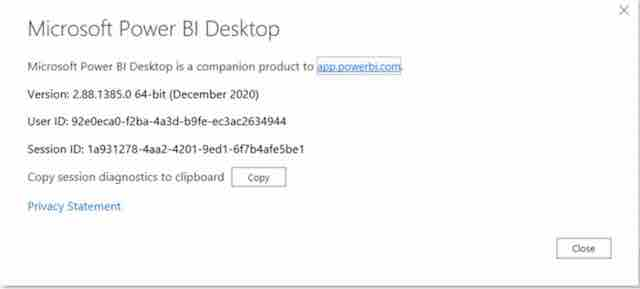

# PowerBI Dashboard and ERS feed

## Goal

Verify that Microsoft PowerBI can be used for producing user-friendly configurable statistical dashboards for Electronic reporting systems (ERS) feeds.
Get answer on the following questions:
1. Does ERS documentation provide a detailed information on the data feed?
2. Do we have enough data in ERS feed?
3. Can we use PowerBI for producing configurable and user-friendly dashboards?

## Input data and Tools
1. ERS feed: http://ers.basel.int/ERSodataReports2/WcfERS_OdataService.svc
2. [ERS feed documentation](Generic%20ODATA%20Feeds%20documentación%20V3%20-%20EN.pdf)
3. PowerBI Desktop

## Target dashboard
We selected the dashoard on the report rate per region for Basel convention as a tarrget dashboard that we need to build at PowerBI. This dashboard should show report rate per region:
1. Africa
2. Asia and Pacific
3. Wester Europe and Others
4. Central and Eastern Europe
5. Latin America)

, and per ERS round (from 2001 to 2019 years).  

##  Question 1: Does ERS documentation provide a detailed information on the data feed?

The answer is **NO**. The ERS feed provided vw_BC_Parties_ReportStatus endpoint which contains data for the target dashboard. The information about this endpoint is missing in the documentation. For getting information about this eendpoint I have to access the corresponding database directly.

##  Question 2: Do we have enough data in ERS feed??

The answer is **YES**. I have managed to build the dashboard based on the feed data.

