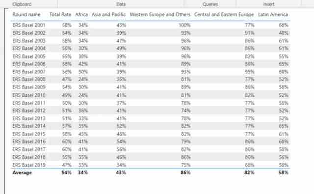

# PowerBI Dashboard and ERS feed

## Goal

Verify that developers can use Microsoft PowerBI for producing user-friendly configurable statistical dashboards for Electronic reporting systems (ERS) feeds.

Get answers to the following questions:
1. Does ERS documentation provide detailed information on the data feed?
2. Do we have enough data in ERS feed for building the PowerBI dashboard?
3. Can we use PowerBI for producing configurable and user-friendly dashboards?

## Input data and Tools
1. ERS feed: http://ers.basel.int/ERSodataReports2/WcfERS_OdataService.svc
2. [ERS feed documentation](Generic%20ODATA%20Feeds%20documentación%20V3%20-%20EN.pdf)
3. PowerBI Desktop

## Target dashboard
We selected the dashboard on the report rate per region for Basel convention as a target dashboard that we need to build at PowerBI. This dashboard should show the reports rate per region:
1. Africa
2. Asia and Pacific
3. Wester Europe and Others
4. Central and Eastern Europe
5. Latin America)

, and per ERS round (from 2001 to 2019 years).  

##   1: Does ERS documentation provide detailed information on the data feed?

The answer is **NO**. The ERS feed provided vw_BC_Parties_ReportStatus endpoint, which contains data for the target dashboard. The information about this endpoint is missing in the documentation. For getting information about this endpoint I have to access the corresponding database directly.

##  Question 2: Do we have enough data in ERS feed for building the PowerBI dashboard?

The answer is **YES**. I have managed to build the dashboard based on the feed data.

[The PowerBI dashboard source code](ers.pbix)

## Question 3: Can we use PowerBI for producing configurable and user-friendly dashboards?

The answer is **YES**. I found that PowerBI is a powerful tool for building analytics dashboards based on the OData feeds provided by BRS Secretariat. PowerBI is highly configurable and has a perfect User Experience interface.

The caveat is that for sharing dashboards on the web, the PowerBI license should support sharing feature. 

